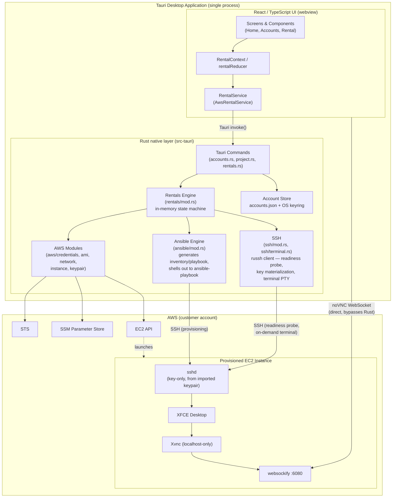
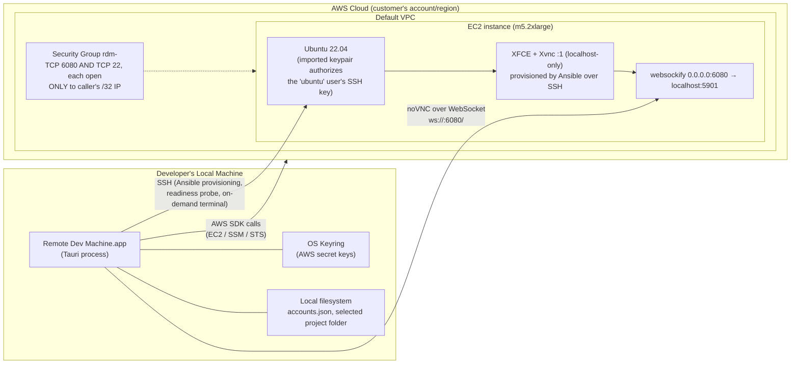

# Architecture

## System summary

Remote Dev Machine is a **single Tauri desktop application** — a React/TypeScript UI running inside a Rust host process — that lets a developer rent a temporary AWS EC2 machine, work on it through an embedded graphical desktop (noVNC), and release it when done. There is **no separate backend service**: all AWS orchestration and the rental state machine run in-process inside the Rust layer (`src-tauri`), as background Tokio tasks spawned by Tauri IPC commands.

This is a deliberate divergence from [`PRD.md`](PRD.md), which describes a 3-tier design with a standalone Go backend and a Go `rental-agent` running on the VM. See [`IMPLEMENTATION_STATUS.md`](IMPLEMENTATION_STATUS.md) for the full breakdown of what's built vs. still aspirational.

## Tech stack

| Layer                | PRD says                         | Actually used                                                                                                                                  |
| -------------------- | -------------------------------- | ---------------------------------------------------------------------------------------------------------------------------------------------- |
| Desktop shell        | Tauri                            | Tauri 2 ✅                                                                                                                                     |
| Frontend             | React + TypeScript               | React 19 + TypeScript ✅                                                                                                                       |
| Native/backend logic | Go backend (separate service)    | **Rust, inside `src-tauri`** — no Go anywhere in this repo                                                                            |
| Cloud                | AWS EC2 via AWS SDK for Go v2    | AWS EC2/SSM/STS via**`aws-sdk-ec2`/`aws-sdk-ssm`/`aws-sdk-sts` (Rust)**, called directly from Tauri commands                       |
| Remote OS            | Ubuntu + XFCE, built via Packer  | Ubuntu 22.04 (resolved live via SSM public parameter) + XFCE, configured post-boot over SSH by a generated **Ansible playbook** (`src-tauri/src/ansible`) — no Packer image, no cloud-init either |
| Remote display       | x11vnc + noVNC                   | **TigerVNC (`vncserver`) + `python3-websockify` + noVNC** ✅ (different VNC server, same shape; now installed/enabled as systemd units by Ansible instead of a cloud-init `runcmd`) |
| Remote terminal      | xterm.js + Go remote-agent + PTY | **`@xterm/xterm`, opened on demand, over a direct SSH PTY session** (`src-tauri/src/ssh/terminal.rs`, using `russh`) instead of a WebSocket to a Go remote-agent |
| Rental storage       | In-memory (MVP)                  | In-memory`HashMap` inside the Tauri process ✅ (matches MVP scope)                                                                           |
| Account storage      | — (not specified)               | JSON file (`accounts.json` in app-local-data-dir) + secret key in OS keyring                                                                 |

## Component diagram

Note the noVNC connection: once a rental reaches `READY`, `RemoteDesktopPanel.tsx` opens a WebSocket **directly from the webview to the EC2 instance's public IP** on port 6080 — it does not proxy through Rust.

## Deployment diagram

Security posture baked into this diagram:

- The security group opens **port 6080 and port 22**, **only to the caller's own current public `/32` IP** — never `0.0.0.0/0`. SSH is now deliberately open (a reversal of the earlier cloud-init-era design), since the app's own Ansible provisioning and on-demand terminal both need it; it is still never widened beyond the caller's own IP.
- VNC itself (`Xvnc`) binds `localhost`-only on the instance; websockify is the only externally reachable noVNC hop.
- SSH access is **keypair-only** — the app generates a fresh Ed25519 keypair per rental, imports it as the EC2 key pair, and never enables password authentication. The private key lives only in the OS keyring, materialized to a `0600` file just before each use and deleted immediately after.
- AWS credentials are always the explicit key pair from the app's own account vault — the default SDK credential chain (env vars, `~/.aws/*`) is never consulted.

## Why no Go backend?

The PRD's 3-tier design (Tauri app ↔ Go backend ↔ Go `rental-agent`) was the intended end-state, but the current implementation took a shortcut for the MVP: fold the backend responsibilities (Rental API, AWS EC2 management, machine state, security) directly into the Rust layer that ships inside the Tauri app. This works because there's exactly one desktop client and no need for a shared/multi-user backend yet. See [`IMPLEMENTATION_STATUS.md`](IMPLEMENTATION_STATUS.md) for the milestone-by-milestone comparison against the PRD.

## Related docs

- [`DOMAIN_MODEL.md`](DOMAIN_MODEL.md) — core types and how Rust/TypeScript mirror each other
- [`RENTAL_LIFECYCLE.md`](RENTAL_LIFECYCLE.md) — state machine and sequence diagrams for start/stop/failure
- [`IPC_API_REFERENCE.md`](IPC_API_REFERENCE.md) — the Tauri command contract between frontend and Rust
- [`FRONTEND_GUIDE.md`](FRONTEND_GUIDE.md) — screens/components/state layout
