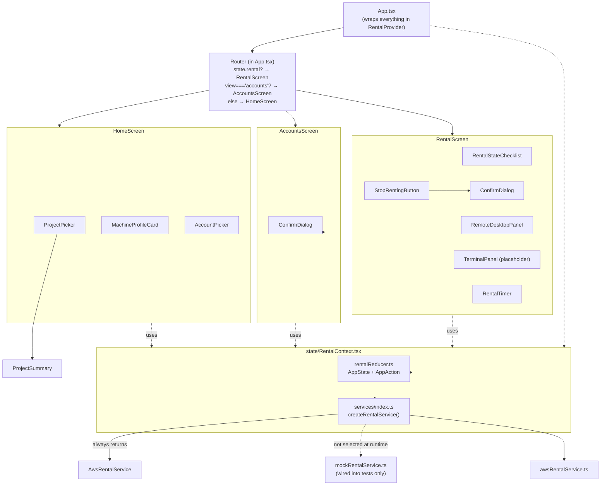

# Frontend Guide

The frontend is a React 19 + TypeScript app (no router library — routing is a local `useState` switch) with a single React Context holding all app state, and a service-interface seam separating "how we talk to the backend" from "what the UI does."

## Component diagram

## Screens

| Screen | File | Purpose |
|---|---|---|
| Home | `src/screens/HomeScreen.tsx` | Configure-and-start screen: project folder, machine profile, AWS account. "START RENTING" calls `rentalService.createRental(...)`, dispatches `RENTAL_CREATED` on success or `RENTAL_ERROR` on failure. |
| Accounts | `src/screens/AccountsScreen.tsx` | Manage saved AWS accounts — list, add (validates live against AWS via `add_cloud_account`), delete (behind `ConfirmDialog`). Calls `lib/accounts.ts` directly, not through `rentalService`. |
| Rental | `src/screens/RentalScreen.tsx` | Shown once `state.rental !== null`. Subscribes to `rentalService.subscribeToRental(rental.id, ...)` on mount, re-subscribing only when `rental.id` changes. Dispatches `RENTAL_UPDATED` each poll tick; dispatches `RESET` when status becomes `RELEASED`. Has local `desktopExpanded` state that hides the header/checklist/terminal/footer for a full-screen remote-desktop view. |

Routing (`App.tsx`) is a plain conditional, not a router library: `state.rental` present → `RentalScreen`; else `view === "accounts"` → `AccountsScreen`; else → `HomeScreen`.

## Components (`src/components/`)

| Component | Purpose |
|---|---|
| `AccountPicker.tsx` | Fetches saved accounts via `listCloudAccounts()`, auto-selects the first one, lets the user pick via a `<select>`, dispatches `ACCOUNT_SELECTED`. "Manage Accounts" link navigates to the Accounts screen. |
| `ProjectPicker.tsx` | Opens the native folder picker (`pickProjectFolder`), inspects the chosen folder via Rust (`inspectProjectFolder`), dispatches `PROJECT_SELECTED`. Renders `ProjectSummary`. |
| `ProjectSummary.tsx` | Renders a selected project's validation state (not found / not readable / empty) or its name/path/file count/size (via `lib/project.formatSize`). |
| `MachineProfileCard.tsx` | Renders the (currently single, hardcoded) machine profile from `data/machineProfiles.ts`. No selection UI, since the MVP hardcodes machine config. |
| `TerminalPanel.tsx` | **Placeholder only.** Explicit comment: stands in for Milestone 4's real xterm.js terminal over a WebSocket to a remote agent's PTY. No `xterm` package is even installed. Renders static "coming in a later milestone" text. |
| `RemoteDesktopPanel.tsx` | The real noVNC integration. Uses `@novnc/novnc`'s `RFB` class to connect to `ws://<publicIp>:<vncPort>/` with the rental's VNC password once status is `READY`/`RUNNING`. Handles `connect`/`disconnect`/`securityfailure`/`credentialsrequired` events. Supports a full-screen expand/shrink toggle with an embedded `StopRentingButton` (labeled "Disconnect") when expanded. |
| `RentalStateChecklist.tsx` | Renders the 5-step provisioning checklist from `lib/rentalChecklist.getChecklistSteps(status)`. Markers: `✓` done, `●` current, `○` pending, `✕` error. |
| `RentalTimer.tsx` | Live elapsed-time display since `rental.startedAt`, ticking every second via `lib/time.formatElapsed`. |
| `StopRentingButton.tsx` | Confirms via `ConfirmDialog`, then calls `rentalService.stopRental(rental.id)`. Relies on `RentalScreen`'s existing `RENTAL_UPDATED` subscription to carry the transition `STOPPING → RELEASED` and trigger `RESET`. |
| `ConfirmDialog.tsx` | Generic modal confirm/cancel dialog (`message`, `confirmLabel`, `onConfirm`, `onCancel`). Reused by `AccountsScreen`'s delete flow and `StopRentingButton`. |

## State management (`src/state/`)

- **`rentalReducer.ts`** — the app-level state machine. `AppState`: `{ projectInfo, selectedMachineProfileId, selectedAccountId, rental, error }` — comment in-code notes this models **a single active rental only**, no history or concurrency (matches the PRD's single-rental MVP scope). `AppAction` union: `PROJECT_SELECTED`, `ACCOUNT_SELECTED`, `RENTAL_CREATED`, `RENTAL_UPDATED`, `RENTAL_ERROR`, `RESET`. Plain reducer — no state-machine library (no XState, etc).
- **`RentalContext.tsx`** — React context/provider (`RentalProvider`, `useRentalState()`). Wraps `useReducer(rentalReducer, createInitialState(MACHINE_PROFILES[0].id))` and instantiates `rentalService` once via `createRentalService()` (memoized with `useMemo`). Exposes `{ state, dispatch, rentalService }` to every consumer via `useRentalState()`.

## Services (`src/services/`)

- **`rentalService.ts`** — defines the `RentalService` interface: `createRental(req)`, `getRental(id)`, `stopRental(id)`, `subscribeToRental(id, onUpdate) -> unsubscribe`. In-code comments map these 1:1 to the PRD's aspirational HTTP API (`POST /rentals`, `GET /rentals/:id`, `POST /rentals/:id/stop`); `subscribeToRental` has no real backend endpoint — it's an abstraction over whatever transport is used (polling today).
- **`awsRentalService.ts`** — `AwsRentalService implements RentalService`, the real implementation. Calls Tauri `invoke()` for `start_rental`/`get_rental`/`stop_rental`. `subscribeToRental` is **client-side polling** of `getRental` every 1500ms (`POLL_INTERVAL_MS`), not a Tauri event listener.
- **`mockRentalService.ts`** — `MockRentalService implements RentalService`, an in-memory fake (see `mockRentalService.test.ts`). Simulates the same status progression (`PROVISIONING → BOOTING → CONNECTING → READY → RUNNING`) on fixed timers (`STEP_DELAY_MS = 400ms`), with its own listener/notify pub-sub.
- **`index.ts`** — the single integration point: `createRentalService(): RentalService` **always returns `new AwsRentalService()`**. The mock exists and is fully implemented, but is currently wired only into unit tests — there's no env/flag switch to select it at runtime.

## Lib helpers (`src/lib/`)

| File | Purpose |
|---|---|
| `accounts.ts` | Thin `invoke()` wrappers: `listCloudAccounts()`, `addCloudAccount(req)`, `deleteCloudAccount(id)`. |
| `project.ts` | `pickProjectFolder()` (native dialog), `inspectProjectFolder(path)` (invokes `inspect_project_folder`), `formatSize(bytes)` (byte → KB/MB/GB/TB formatter). |
| `rentalChecklist.ts` | `getChecklistSteps(status: RentalStatus): ChecklistStep[]` — maps each status to the 5-step checklist with done/current/pending/error markers. |
| `time.ts` | `formatElapsed(ms): string` — formats milliseconds as `"Xh Ym Zs"` / `"Ym Zs"` / `"Zs"`. |

`rentalChecklist.ts` and `time.ts` each have a matching `.test.ts` (Vitest).

## Related docs

- [`DOMAIN_MODEL.md`](DOMAIN_MODEL.md) — the types these components/services pass around
- [`RENTAL_LIFECYCLE.md`](RENTAL_LIFECYCLE.md) — what drives `RENTAL_UPDATED` dispatches over time
- [`IPC_API_REFERENCE.md`](IPC_API_REFERENCE.md) — what `awsRentalService`/`lib/*` actually call into
- [`IMPLEMENTATION_STATUS.md`](IMPLEMENTATION_STATUS.md) — status of `TerminalPanel` and the mock-service runtime switch
