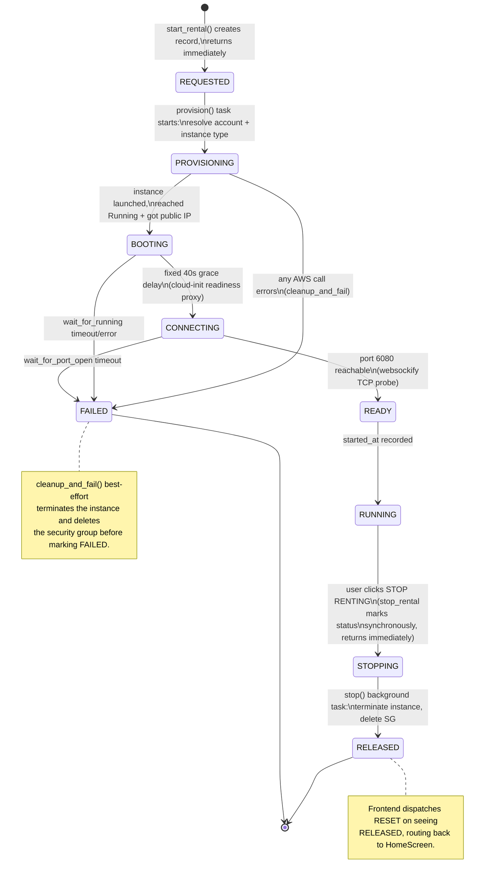
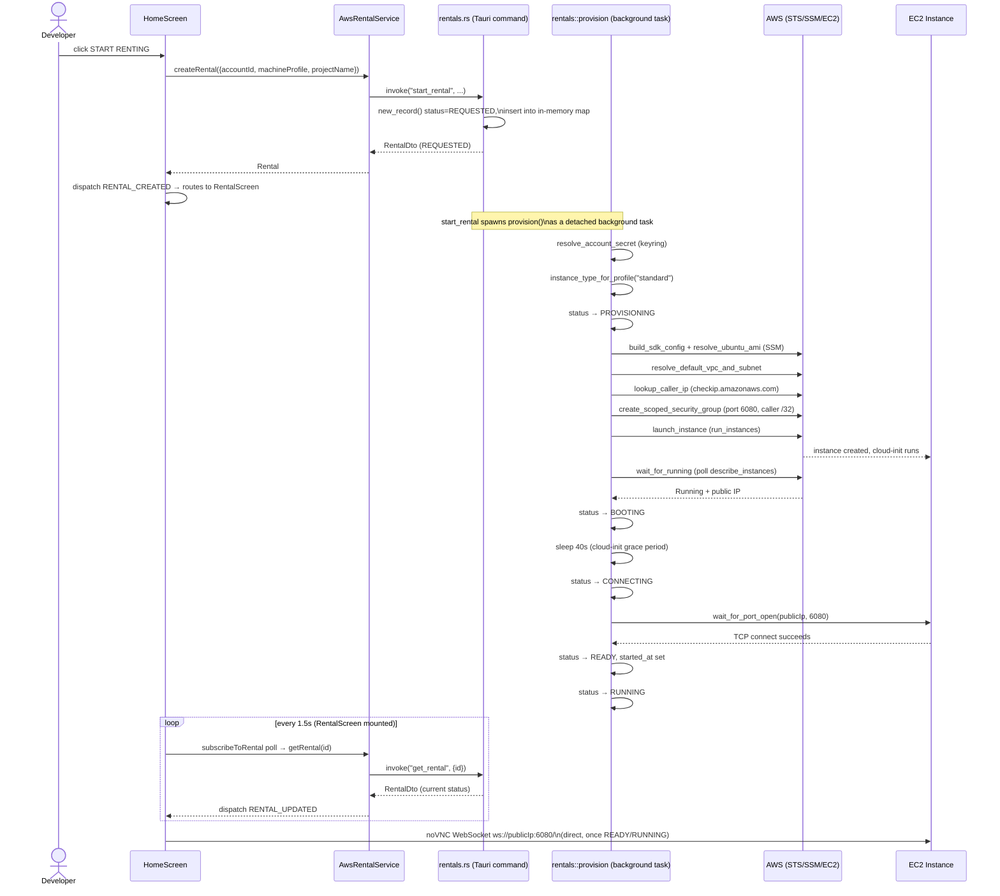
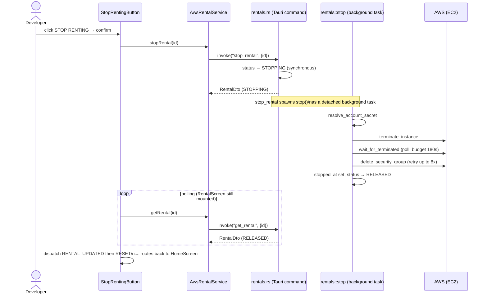
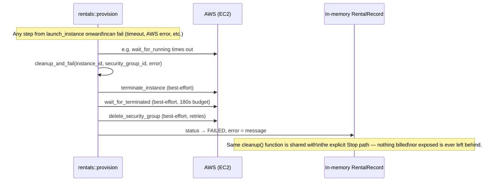

# Rental Lifecycle

A rental moves through a fixed sequence of `RentalStatus` values, driven entirely by the Rust side (`src-tauri/src/rentals/mod.rs`) and mirrored to the frontend by 1.5-second polling of `get_rental` (`src/services/awsRentalService.ts`).

## State diagram

## Sequence: Start Renting

## Sequence: Stop Renting

## Sequence: Provisioning failure (cleanup path)

## Frontend checklist mapping

`src/lib/rentalChecklist.ts` maps each `RentalStatus` to a 5-step UI checklist (`Finding machine → Creating VM → Booting Ubuntu → Connecting to remote machine → Preparing workspace`), rendered by `RentalStateChecklist.tsx`. `RUNNING`/`STOPPING`/`RELEASED` show all steps done; `FAILED` flags the first step as errored (the UI can't know which real backend step failed, so it doesn't attempt to guess beyond that).

## Related docs

- [`DOMAIN_MODEL.md`](DOMAIN_MODEL.md) — `RentalStatus`, `RentalRecord`, `RentalDto`/`Rental` shapes
- [`IPC_API_REFERENCE.md`](IPC_API_REFERENCE.md) — `start_rental`/`get_rental`/`stop_rental` command signatures
- [`ARCHITECTURE.md`](ARCHITECTURE.md) — where this state machine sits in the overall system
